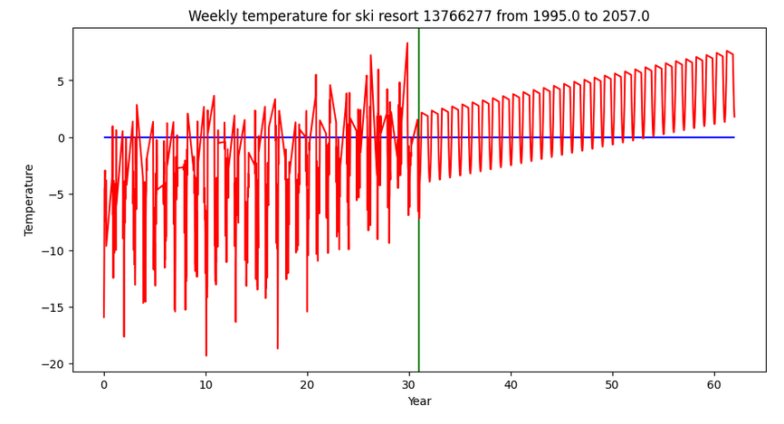
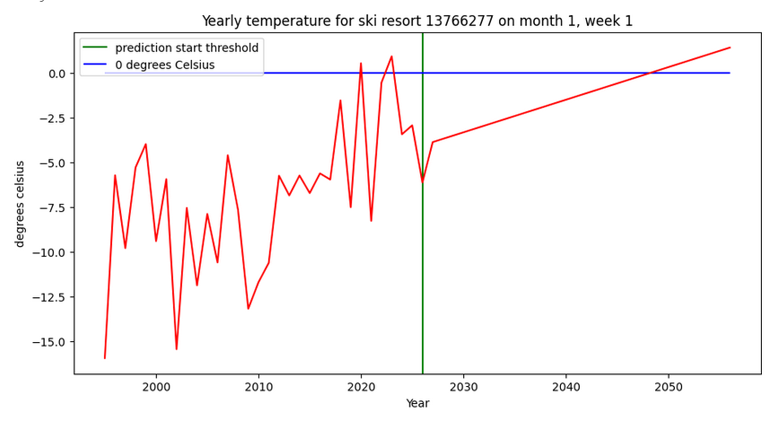
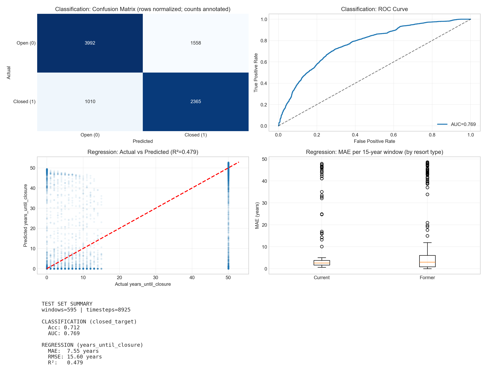

# ID2223-Project

Project page is live and can be viewed at: [https://triggerdude33.github.io/ID2223-Project/](https://triggerdude33.github.io/ID2223-Project/)

## Introduction

The aim of the project is to predict ski resort closures in the European alps for the next 30 years due to climate change.

### Prediction problem

Predict, for all current open ski resorts in the alps, if it will close down due to climate change within the next 30 years. If so, specify which year.

### Solution overview

To solve the above prediction problem, we have implemented two models:
* `weather_model`. Given 30 years of historical weekly temperature data, predict 30 years of future weekly temperature data.
* `shutdown_model`. Given a 30-year sliding window of weekly temperature data, estimate on which year the ski resort closed/will close down. 

### Data sources
We have the following dynamic data sources:
* [Open-meteo](https://open-meteo.com)
* [Abandoned ski towns](https://abandonedskitowns.com/)
* [Open street map](https://www.openstreetmap.org)

### Assumptions and limitations taken regarding the data

* We assume that all ski resorts which have closed down, did so due to climate change.
* We only look at winter season weekly weather (november-march) for predicting ski resort closure.
  * No daily temperature, snow depth or wind etc.
* We take resorts from North America also to train `shutdown_model`. This was due to there not being enough qualified closed ski resort samples in Europe to create a large enough training dataset.

## Method

### Overview

The project is divided into 5 steps. See the table below.
| Step | input | process | output |
| --- | --- | --- | --- |
| 1: annual resort feature pipeline | [Abandoned ski towns](https://abandonedskitowns.com/) and [Open street map](https://www.openstreetmap.org) | from sources, prepares ski resort name, latitude, longitude and id for export to hopsworks | `current_resorts` and `former_resorts` fg
| 2: annual weather feature pipeline | `current_resorts`, `former_resorts` fg, [Open-meteo](https://open-meteo.com) | get historical weather data for open and closed resorts | `ski_weather` fg
| 3: `weather_model` | `current_resorts`, `ski_weather` fg | creates predictions for open resorts future winter climate | `predicted_ski_weather` fg |
| 4: `shutdown_model` | `closed_resorts`, `open_resorts`, `ski_weather`, `predicted_ski_weather` fg | trains on historical data and creates predictions for when currently open ski resorts will close down | `shutdown_predictions` fg |
| 5: update dashboard | `shutdown_predictions` fg | updates the table on the dashboard with the latest added ski resort shutdown predictions | [github page](https://triggerdude33.github.io/ID2223-Project/)

Note. "fg" stands for "feature group"

Each step corresponds to a python notebook in the github repository.

The goal was to have each step run as a scheduled pipeline on github. This to get an automatic update for future ski resort closures, based on the data fetched from the data sources. However, we were unable to reach this state. A large problem was the API limits for Open-Meteo, more on this is described in Step 2.

### Step 1: Annual resort feature pipeline

Firstly, and API requesst is sent to the backend database of [Abandoned ski towns](https://abandonedskitowns.com/). From this, data for all closed down resorts are obtained. We receive name, latitude, longitude, and year which the resort closed down. Many resorts are filtered out due to two reasons:
* The resort does not list the exact year closure
* The resort is not located in Europe or North America

Once the filtering is done, the remaining data is uploaded to hopsworks. Open resorts are uploaded to `current_resorts` and closed resorts are uploaded to `former_resorts`.

Below are some statistics:
* 241 closed resorts were uploaded to hopsworks
* 839 open resorts were uploaded to hopsworks

### Step 2: Annual weather feature pipeline

#### Open-Meteo API limits

There is a 600 API call limit per minute to open meteo. The number of API calls corresponds to the number of dates you query for. Furthermore, you can query for the same date for several locations, and it will scale less than lineraly seen to the amount of API calls. This is why we decided to fetch temperatures on a date basis, instead of on a ski resort location basis

#### Fetching data

In this step, all weather data for either closed or open resorts for a specific year is fetched. The `ski_weather` fg is downloaded. It is checked what latest year `ski_weather` contains, firstly for closed resorts and then for open resorts. Name the latest year `y`. If `y` for any resort type is found to be smaller than last year, it will download temperature data for `y+1` from Open-Meteo for all resorts for that resort type (for open resorts only data for the first 100 resorts are downloaded, see discussion paragraph below). The data received from Open-Meteo will be of the average daily temperature for the winter season months (November-March). Only fetching weather data for winter season months (November-March) was advantageous for saving API calls to Open-Meteo. We believe fetching temperatures for the winter months would add very little to our prediction performance. The daily temperature data is reformatted to weekly temperature data. The weekly temperature is calculated by taking the mean of all days making up that week. The data is then uploaded to hopsworks.

#### Differences in fetching for open and closed resorts

For closed resorts, weather data for 15 years before and 15 years after the resort closing is fetched. This gives us a 30 year interval of historical weather data in total. This is done to better train `shutdown_model`: we use a sliding 20-year window approach, generating multiple training samples per resort by sliding across the 30-year span. This way, the model sees varied closure timing within each window and learns to predict based on temperature patterns rather than absolute years. More on this in Step 4.

For open resorts, weather data for the last 30 years is fetched. For the purposes of `shutdown_model`, only the last 15 years are necessary, since `weather_model` will predict the last 15. For `weather_model` however, we found that 15 years of historiccal data seemed a bit to small for seeing any substantial climate warming trend. Thus, we increased from 15 to 30 years of historical data for open resort, so that `weather_model` may better optimize its **Trend kernel** (See "Step 4 `weather_model`").

#### Discussion

We were not able to fetch temperature data for all resorts at once from Open-Meteo, due to the API limit. So the decision was made to instead fetch temperature data first for closed resorts and then for open resorts, one winter year at a time. This worked for closed resorts, but for open resorts we hit the API limit once again. To solve this, we only fetched temperatures for the first 100 open resorts and skipped predicting shutdown for the other open resorts. Had there been more time, we would have modified the notebook so that it fetches all temperature data for a single year for a particular resort `r`. Then the notebook could be run on an hourly pipeline, meaning we would get all necessary data for an open resort after about 15 hours. We could then have had `weather_model` and `shutdown_model` run on a daily pipeline, predicting weather values and shutdown year for `r`.

### Step 3: `weather_model`

To predict future weather for ski resorts, we utilize a gaussian process model. The model has three different kernels, meant to model different aspects of the weather:
* **Trend kernel**. This kernel models the climate change. It is set to force the trend to be linear. That is, each year it will increase the temperature by the same amount. 
* **Seasonal kernel**. Models seasonal variety in temperature. It is a periodic kernel, where the period is one year. 
* **Weather kernel**. Models the unpredictable weather chaos.
The final predicted result for a week is the sum of the three kernels.

To say the least, it is a bold statement to assume that climate change is linear. It could also be exponential, or perhaps polynomial. Had there been more time, we would have explored different trend kernels to model the climate trend. The different growth expectations would need to be compared using some form of metric. Thus a fitting prediction performance metric would need to be found also.

`weather_model` is not trained on historical data for other ski resorts before making its inference. In other words, it only optimizes its hyperparameters using the historical data for the current resort it is predicting for. Temperature trends and seasonal variety differs between locations, therefore we don't see the value in training the model on closed resort weather before making inference on open resort weather. In addition, we haven't found any examples of gaussian process models being trained in this way: If traning on closed resorts would be considered, a metric would need to be found which could measure the accuracy of `weather_model` temperature predictions against the actual historical data. 

For a resort, `weather_model` outputs as many years of predicted data as the resort has historical data in hopsworks. This design decision was done simply because it saved on development time. As explained in Step 2, 30 years of historical data is fetched for open resorts. This means that `weather_model` predicts 30 years of data for each open resort and uploads it to hopsworks - which works out well since `shutdown_model` uses a 30-year inference horizon.

See the two below figures for a visualization of a typical `weather_model` prediction for a ski resort. 

Note that for the yearly temperatures figure, it can be observed that the identical week from year to year increases by the same constant amount. This shouldn't be the case, **Weather kernel** should create slight weather chaos to the temperature values.  Hence, it could imply that the **Weather kernel** wasn't correctly setup.

### Step 4: `shutdown_model`

To predict when a ski resort will close, we use a multi-task Seq2Seq LSTM. The model takes two inputs and produces two outputs per timestep:

**Inputs:**
* Weekly temperature sequences: `(T, 52)` - T years of 52 weekly temperatures each
* Geographic features: `(2,)` - latitude and longitude

**Outputs (per year in the sequence):**
* Classification: P(closed) - probability that the resort has closed by this year
* Regression: years_until_closure - estimated years remaining until closure

#### Why multi-task?

We wanted both "nice" probability curves (classification) and year-level timing precision (regression). The classification head gives us interpretable probabilities, while the regression head helps pin down the exact closure year. We weight classification loss higher (1.0 vs 0.1) to prioritize the probability estimates.

#### Data preparation

We use a sliding window approach with 20-year fixed windows. For each resort, we slide a 20-year window across its available data, generating multiple training samples. This acts as data augmentation and removes the need for padding. Important: we split by resort (not by window) to prevent data leakage - if resort X is in the test set, none of its windows appear in training.

**Targets:**
* `closed_target`: 0 if resort is open that year, 1 if closed (derived from `year_closed`)
* `years_until_closure`: countdown to closure (e.g., 5, 4, 3, 2, 1, 0, 0, ...). For open resorts we set this to 50 (a large "not closing" value).

#### Architecture

Two stacked LSTM layers (64 and 32 units) process the temperature sequences. The geo features (lat/lon) are embedded via a dense layer and broadcast across timesteps, then concatenated with the LSTM output. Two output heads (classification + regression) are applied per timestep via TimeDistributed layers. Dropout (0.3) is used for regularization.

Note: while trained on 20-year windows, the model accepts any sequence length T at inference time (the LSTM uses a dynamic time dimension). This lets us run inference on 30 years of predicted weather without retraining.

#### Training

* Early stopping (patience=7) + LR scheduler (factor=0.5, patience=3)
* Dropout 0.3 for regularization
* Adam optimizer, initial LR=0.001
* Trained on ~2800 windows from 237 resorts

#### Results

Test set (398 windows from 34 held-out resorts):

| Task | Metric | Value |
|------|--------|-------|
| Classification | Accuracy | 0.848 |
| Classification | AUC | 0.858 |
| Regression | MAE | 6.30 years |
| Regression | RMSE | 14.68 years |
| Regression | R2 | 0.551 |

For reference, a "always predict open" baseline gets 63.5% accuracy. The regression baseline (always predict train mean) has MAE of 19.8 years. So the model is clearly learning something useful.

#### Sanity checks: is the model actually using weather?

We ran ablation studies to verify the model isn't just memorizing shortcuts:

| Ablation | Accuracy | AUC | Reg MAE |
|----------|----------|-----|---------|
| Full (weather + geo) | 0.848 | 0.858 | 6.30 |
| Weather only (geo=0) | 0.843 | 0.865 | 10.69 |
| Geo only (weather=0) | 0.728 | 0.813 | 14.46 |
| Shuffle years order | 0.783 | 0.785 | 11.09 |
| Shuffle weeks order | 0.691 | 0.811 | 15.69 |

Takeaways:
* Removing geo hurts regression more than classification - makes sense, location affects how warm is "too warm"
* Removing weather hurts both tasks significantly
* Shuffling the year order drops performance - the model uses temporal patterns
* Shuffling weeks within years hurts even more - weekly patterns matter

#### Feature importance

We computed gradient-based saliency maps to see which weeks the model pays attention to. Result: **winter weeks (1-5) are most important**, which aligns with intuition - early winter conditions likely determine if a season is viable.

#### Inference

For inference on `predicted_ski_weather`, we run the model on a 30-year horizon. If P(closed) exceeds 0.5 for any year within the horizon, we mark `will_shutdown=1` and record that year as `shutdown_year`. Results are uploaded to the `shutdown_predictions` feature group.

#### Discussion

The model performs reasonably well given the limited input (only temperature). Adding snow depth and wind data would likely improve predictions, but would require `weather_model` to forecast those dimensions too. Another limitation is our assumption that all historical closures were climate-related - in reality, some resorts close for economic or other reasons.

### Step 5: Update dashboard

This step fetches all data rows from the `shutdown_predictions` feature group. It then dynamically creates a markdown table listing the data. The file `docs/index.md` in the github repository is then updated with the new markdown table. A daily pipeline schedule is currently running. It executes this step and commits the file changes made in `docs/index.md` to the github repository. This way, the dashboard [github page](https://triggerdude33.github.io/ID2223-Project/) is automatically updated.

